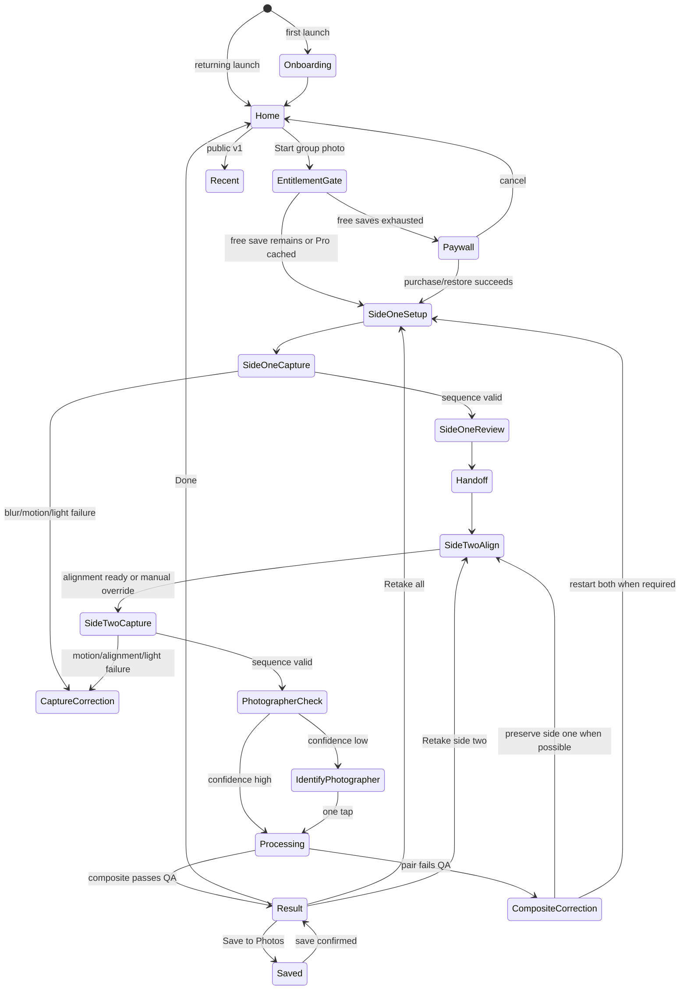
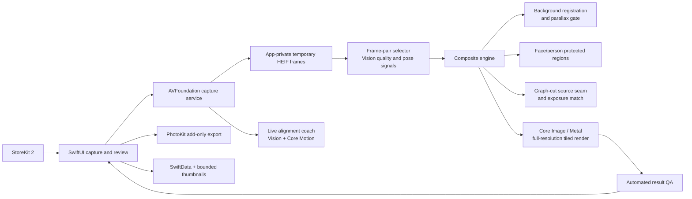

# groupCam - Product Requirements Document

| | |
|---|---|
| **Product** | groupCam - an iPhone camera that puts both photographers into one natural group photo |
| **Platform** | Native iPhone app; iOS 18 or later; prototype tuned first on iPhone 16 Pro Max |
| **Status** | v0.9 implementation draft - founder interview agreed 2026-07-13; `groupCam` selected as the current name, with pre-launch clearance pending |
| **Companion docs** | `Project Build Guide.md` (accounts, signing, repository, deployment, and device workflow - follow it; do not restate it) |

**Locked terminology:** “Prototype” means the feasibility and product-validation build. “Public v1” means the first U.S. App Store release. `groupCam` is the founder-selected name for the prototype and current public-name candidate. Do not rename it unless Justin directs otherwise or App Store/legal clearance blocks its use.

## 1. Overview and Vision

### The problem

Friends and families often want a group photo when nobody outside the group is available to take it. The current choices all diminish the result: ask a stranger, leave one group member behind the camera, use a timer and prop up the phone, or take a wide selfie that places the photographer unnaturally close to the lens. The missing photographer is frequently the person who organizes and documents the occasion, so that person is repeatedly absent from the memory.

### The one-line solution

groupCam guides two people through taking turns with the same iPhone, then automatically combines the best real frames into one full-quality photo in which everyone appears naturally.

### Why this approach wins

The app uses the full-resolution rear camera and a guided handoff instead of accepting distorted selfie perspective. A live alignment coach helps the second photographer restore the first camera position. The app then selects the strongest frames, aligns the static scene, protects every person from the blend seam, matches color and exposure, and creates one composite from authentic captured pixels.

The experience is differentiated by four promises:

1. **Photographic truth:** no generated faces, bodies, clothing, or meaningful scene content.
2. **Private by design:** capture, analysis, and compositing stay on the iPhone and work offline.
3. **Quality before false confidence:** the app requests a specific retake instead of silently exporting a defective image.
4. **No editing work:** the normal path is capture, hand off, capture, review, and save.

Google Pixel Add Me and current iPhone competitors validate the need, so the product must not claim conceptual novelty. groupCam competes on iPhone availability, privacy, authentic source pixels, maximum practical resolution, capture coaching, and dependable output.

## 2. Users

### Primary user: the group documentarian

- A friend or family member who normally takes the photo and is frequently missing from it.
- Uses a recent iPhone and understands the standard Camera app but not photographic compositing.
- Wants a result suitable for messaging, social media, zoomed inspection, and common print sizes.
- Values image quality and easy capture above processing speed.
- Does not want to learn masks, layers, seams, face replacement, or AI prompting.

### Secondary user: the second photographer

- Receives the unlocked phone for less than a minute.
- May never have seen the app and should not need an account or tutorial.
- Needs short, visible instructions: where to stand, how to align the phone, when to hold still, and when the capture sequence is complete.

### Group subjects

- Two to twelve friends or family members, potentially including children and pets.
- May move slightly, blink, change expression, or misunderstand a direction.
- Are not app operators and must not need individual setup.

### Supported operating assumptions

- The two photographers can occupy opposite outside edges of the group.
- The unchanged group can hold roughly the same pose for the short interval between sides.
- The second photographer can stand near the first photographer’s camera position, though not perfectly.
- The scene has a mostly stable background and enough light for sharp rear-camera photos without flash.

## 3. Goals and Success Criteria

### Goals

- Make the two-photographer workflow understandable on the first real attempt.
- Produce a natural, high-resolution group photo that withstands 100% zoom and ordinary printing.
- Keep every photo and all person analysis on-device.
- Automatically choose the strongest source frames without individual face picking.
- Detect unsalvageable capture pairs early and give one precise correction.
- Preserve the originals and standard capture metadata when the user saves.
- Establish technical feasibility before investing in App Store polish and marketing.

### Prototype success criteria

- A **keeper** is a result that passes the app's measurable risk gates, meets the output floor, contains no prohibited person defect under the written artifact rubric, and receives approval from at least two of three reviewers who are blinded to the source boundary.
- Benchmark exactly 30 consented supported-envelope sessions for the prototype gate: at least 6 two-person sessions, 12 sessions with 3-6 people, and 12 sessions with 7-12 people. Include at least 20 sessions captured at 1x and 10 at 0.5x, with both lenses represented in every group-size band.
- Across that distribution, include indoor, outdoor, backlit, low-detail-background, glasses, detailed hair, mild group motion, and modest camera-position error cases. Pets are best-effort and excluded from the keeper-rate denominator for v1.
- At least 24 of 30 supported-envelope sessions produce a keeper on the initial two-sided attempt.
- At least 29 of 30 supported-envelope sessions produce a keeper within one guided retake.
- Zero results labeled successful contain a missing person, duplicated person, identity alteration, visibly deformed body, or seam crossing a protected face/body region.
- At least 90% of results that pass automated risk gates receive keeper approval from at least two of the three blinded reviewers at 100% zoom using the benchmark artifact rubric.
- On Justin’s iPhone 16 Pro Max, p95 time from the final side-two photo callback to composite preview is at most 10 seconds, and p95 time from Save tap to PhotoKit completion is at most 20 seconds.
- If the largest safe crop from the selected base frame contains at least 12,000,000 source pixels, output contains at least 12,000,000 pixels. Otherwise the engine preserves the largest safe crop. It never upscales solely to satisfy the pixel-count criterion.
- The complete capture and composite flow succeeds with airplane mode enabled.
- Network inspection finds no app-controlled upload of a photo, thumbnail, EXIF, face/person result, or capture-session identifier. User-directed Share/Photos/iCloud destinations and Apple-managed StoreKit traffic are excluded from this test.
- Report keeper rate, prohibited defects, output size, and timing separately for 1x versus 0.5x and for each group-size band so easy cases cannot hide a failing subgroup.

**The one-sentence test:** At a real friends-or-family gathering, two people pass one iPhone, follow the prompts without explanation, and save a print-worthy group photo containing everyone within one guided retake.

## 4. Scope

### In scope: feasibility prototype

- Native iPhone app built and tuned first on iPhone 16 Pro Max.
- Guided two-photographer capture on one device.
- Physical rear 1x camera by default and an optional physical 0.5x camera selected before side one, plus familiar pinch zoom; the exact lens and zoom stay locked for both sides.
- Portrait and landscape orientation, locked after side one.
- Three-frame automatic capture sequence per side by default.
- Debug/test setting for one, three, or five frames per side.
- Automatic best-pair selection using sharpness, capture quality, expression/pose quality, group stability, and alignment potential.
- Onion-skin overlay and live alignment directions for side two.
- Visible multi-frame capture state, motion validation, and precise retake guidance.
- On-device registration, protected-region source selection, color matching, seam optimization, multiband blending, crop, straighten, and automated output QA.
- One-tap identification fallback if the joining photographer cannot be identified confidently.
- Post-capture review, zoom, save, share, and retake.
- Save the selected side-one original, selected side-two original, and final composite by default; optional final-only setting.
- Preserve date, time, location when authorized, orientation, and appropriate camera metadata.
- Camera and Photos add-only permissions requested just in time.
- No backend, login, analytics SDK, image upload, or runtime generative-AI service.

### In scope: public v1 after the prototype gate passes

- Production onboarding, restrained skeuomorphic visual system, accessibility, privacy copy, and help.
- Provisional public-v1 option: a bounded local Recent history made of thumbnails and capture metadata; Apple Photos remains the full-resolution system of record. Justin must approve this before Phase 4 implementation.
- StoreKit 2 one-time Pro unlock: three successful full-quality composite saves free, then $9.99 to unlock unlimited composites.
- Restore Purchase and clear pre-capture paywall behavior; failed captures and retakes never consume a free use.
- U.S. App Store release in the general 4+ Photo & Video category.
- Privacy policy, App Privacy answers, SDK/privacy-manifest audit, accessibility pass, and pre-launch freedom-to-operate review.

### Out of scope (non-goals)

- **No generative people or scene reconstruction:** the app does not invent faces, bodies, hands, clothing, jewelry, text, pets, or meaningful background content.
- **No cloud processing or accounts:** privacy, offline operation, latency, and cost predictability are part of the product promise.
- **No manual editor:** no masks, brushes, layers, seam painting, sliders, face pickers, filters, or retouching controls in public v1.
- **No per-person face replacement in v1:** the engine selects the best overall source frames; independent face transplants are deferred because they can reduce realism and complicate large-group identity association.
- **No import of arbitrary existing photos in v1:** guided in-app capture provides the controlled lens, exposure, overlap, and alignment needed for reliable output.
- **No flash-dependent workflow:** flash and major lighting changes make the two shots difficult to match.
- **No RAW or ProRAW workflow:** processed HEIF preserves Apple’s computational photography while keeping memory and processing manageable.
- **No selfie/front-camera mode:** the product promise is rear-camera group-photo perspective.
- **No Android or companion platforms:** no iPad-specific layout, Apple Watch remote, multi-phone synchronization, video, social network, collaborative album, or web account.
- **No promise of success outside the supported capture envelope:** difficult scenes receive honest warnings and retake instructions.

### Deferred (v2+ candidates)

- Importing a user-selected pair through PhotosPicker.
- Per-person expression selection or replacement after separate benchmark and authenticity review.
- More robust local mesh warp or tightly controlled optical flow for moderate parallax.
- Custom on-device Core ML matting for hair, pets, overlapping people, and groups larger than Apple’s reliable instance-mask range.
- HDR/gain-map-preserving export, optional depth-aware refinement, and ProRAW experimentation.
- Limited-access PhotoKit integration for reopening and resharing past full-resolution results.
- Manual “use this source here” correction as an expert escape hatch.
- Apple Watch or second-device remote shutter.
- International launch, localization, and any required machine-readable provenance disclosures.
- Carefully bounded background-only repair, only if it never affects people and is explicitly disclosed.

## 5. Product Principles

1. **The people must remain real.** Captured identity and appearance beat synthetic perfection.
2. **Guidance beats rescue.** Prevent camera displacement and movement before asking an algorithm to fix them.
3. **Quality beats speed, within a human wait.** A short, clearly explained processing pause is acceptable; a visibly fake result is not.
4. **One obvious path.** The normal user should never choose masks, faces, seams, or algorithms.
5. **Private and offline by default.** The app never uploads photos for processing. Capture and compositing stay on-device; photos or metadata leave the device only through a destination the user explicitly chooses, such as Apple Photos/iCloud or Share. No account is required.

## 6. Functional Requirements

### 6.1 Primary state machine

Setup, capture, handoff, alignment, identification, correction, processing, and result screens all expose Cancel or Back when safe. Cancel before full-resolution work begins exits immediately; once sources exist, confirm that unsaved photos will be deleted. On confirmation, delete the active session according to Section 6.15 and return Home.

### 6.2 First-run onboarding

The onboarding uses three illustrated, skippable cards and can be replayed from Help:

1. **Take turns:** “First photographer takes the group. Then pass the phone.”
2. **Swap the outside spot:** show Photographer B on one outer edge in side one and Photographer A on the opposite outer edge in side two.
3. **Match and hold:** show the translucent alignment overlay and the multi-frame “Capturing - hold steady” state.

The final card states: “groupCam does not upload your photos for processing. It combines real captured pixels on this iPhone and does not regenerate people.” The primary control is **Start a group photo**. Camera permission is not requested until that control is used.

States:

- **Normal:** page indicator, Back, Skip, and primary control.
- **Reduce Motion:** use fades and static diagrams instead of sliding photo-card animations.
- **VoiceOver:** every diagram has a concise spoken description; the page order and controls are deterministic.

### 6.3 Home

Top to bottom:

- groupCam wordmark.
- One-sentence prompt: “Two photos. Everyone in.” This is placeholder copy, not the final public name/tagline.
- Large tactile **Start a group photo** control.
- A compact **How it works** link.
- Public v1 only: Recent thumbnail strip with the latest three captures and **See all**.
- Settings button.

Empty state: before a saved result, Recent is omitted rather than showing an empty container.

Camera permission denied: starting a session opens an explanatory sheet with **Open Settings** and **Not now**. The app does not repeatedly trigger the system prompt.

On the first session after camera permission succeeds, show one optional preflight card: **Add the place to your photos?** Choosing **Add Location** requests When In Use location permission with `NSLocationWhenInUseUsageDescription`; **Not now** continues without location. Denied, restricted, or unavailable location never blocks capture. Approximate coordinates are accepted when that is all the user grants. Settings provides a later **Add Location Metadata** toggle and an Open Settings affordance after denial.

### 6.4 Side-one setup and capture

Before the live preview begins, show the instruction card for at least two seconds, then require **Ready** rather than auto-dismissing it:

> Photographer A: Ask the next photographer to stand at one outside edge. Leave room on the other edge for yourself. After the photo, wait while they take the phone.

Capture interface requirements:

- Full-bleed rear-camera preview.
- 1x default and 0.5x option before the first capture only. Hide 0.5x when the device has no physical ultrawide camera. Allow pinch zoom before side one, cap digital zoom at 2x per physical lens to protect output quality, show effective magnification separately from the fixed physical-lens labels, and disable both controls after side one.
- Orientation follows the device until the first sequence begins, then locks for the session.
- Flash control is absent; low light produces guidance rather than enabling flash.
- Large tactile shutter control, sequence mode badge (`Auto` or `Single` in public v1), and Help.
- Before side one, continuous autofocus, auto exposure, and auto white balance converge. At side-one sequence start, record lens position, exposure duration/ISO, and white-balance gains; keep exposure and white-balance locked for the pair. Before side two, refocus once at the registered scene distance and lock the new focus position. If the retained exposure/white-balance values no longer produce an acceptable match, restart both sides instead of silently changing them.
- The physical lens, zoom, maximum supported processed-photo dimensions, color mode, crop policy, and orientation remain identical for both sides.

On shutter press:

1. Start a visible three-second countdown.
2. Disable repeat shutter input.
3. Display **Capturing - hold steady** with a progress ring around the shutter.
4. Capture the configured sequence; default is three high-quality processed HEIF frames over the shortest empirically reliable interval.
5. Produce a light haptic and visible tick for each frame, with a stronger completion haptic.
6. Keep the live preview visible until the final frame completes so the user knows to remain still.
7. Reject the sequence only when no frame meets the side-quality threshold, or when camera motion/configuration instability invalidates registration for the entire sequence. A bad individual frame is discarded rather than invalidating an otherwise useful sequence.

Capture the best available location fix at each side's sequence start when authorized. Each selected original keeps its own capture timestamp and side-specific location. The composite inherits the selected side-one timestamp and location. All session location values are deleted after export, cancellation, or abandoned-session cleanup.

The exact cadence is a benchmark output, not a hardcoded one-second promise. Debug builds expose 1/3/5-frame choices and scoring diagnostics.

### 6.5 Side-one review and handoff

Provisional side-one scoring begins immediately. If at least one frame is acceptable, choose a provisional overlay frame and show it briefly with:

> Got it. Keep the group in place and pass the phone to the person at the outside edge.

Joint frame-pair selection does not occur until side two exists and may replace the provisional side-one choice. The handoff screen uses a large two-person diagram and remains readable at arm’s length. It says:

> Photographer B: Take the phone from the same spot. Photographer A, join the open outside edge.

Controls: **I have the phone**, **Retake**, and Help. Photographer A is specifically instructed to wait near the original camera position until Photographer B arrives, reducing “H-O-R-S-E”-style position drift without requiring a physical ground marker.

### 6.6 Side-two alignment

After Photographer B confirms the handoff:

- Show the live preview with a translucent, edge-enhanced overlay derived from side one.
- Mask/down-weight people in live registration so the stable background drives alignment.
- Use image registration plus device attitude to provide simple directions: **move left/right**, **raise/lower phone**, **step forward/back**, **rotate slightly**, and **hold level**.
- Show a readiness indicator that changes shape, label, and color; color alone never communicates status.
- Show Photographer A’s target outside zone on the side opposite Photographer B’s side-one position.
- Warn if Photographer A overlaps another person so heavily that a protected donor region is unlikely.
- Permit shutter capture when alignment is good. After a reasonable timeout, permit **Try anyway** but label the higher risk before capture.

Alignment must tolerate normal handheld error. It must not demand pixel-perfect overlay or make the second photographer chase a constantly changing target.

### 6.7 Side-two capture

Side two uses the same countdown, visible multi-frame capture, progress ring, per-frame haptics, and motion validation as side one. The locked physical lens and capture configuration cannot change.

If side-two capture is invalid, preserve the selected side-one sequence whenever the failure does not invalidate the pair. The correction names one issue only, for example:

- “The phone moved while capturing. Hold still until the ring closes.”
- “Move closer to the first camera position.”
- “The lighting changed too much. Turn back toward the original light.”
- “The open spot is blocked. Give the joining photographer a little space.”
- “Someone in the middle moved too far. Ask the group to freeze for one more photo.”

### 6.8 Automatic frame selection

For each side, rank frames using:

- focus/sharpness and motion blur;
- aggregate face capture quality without persistent face embeddings;
- closed-eye and gross expression heuristics when reliable;
- occlusion and crop safety;
- body/pose stability;
- exposure and white-balance consistency;
- compatibility with background registration and the opposite side.

Select the best pair jointly rather than selecting each side independently. Favor a stable shared group and clean composite over one locally better expression that creates movement or occlusion artifacts.

Public v1 does not transplant individual faces. “Best expressions” means selecting the strongest overall frame pair.

### 6.9 Photographer identification fallback

The engine should infer Photographer B as the person present at one outside edge in side one and missing from side two, and Photographer A as the person newly present at the opposite outside edge in side two. Use spatial association after registration rather than identity recognition or persistent biometric templates.

If confidence is low, show side two and ask: **Tap the photographer who just joined the group.** The screen supports zoom and allows one correction. Do not expose masks or technical terminology.

### 6.10 Composite processing

Show a single progress experience with plain-language stages such as **Choosing the best moments**, **Lining up the scene**, **Bringing everyone together**, and **Checking the result**. Do not show an indefinite spinner. If estimated progress stalls, keep the current stage visible and offer Cancel only after five seconds.

The authenticity, privacy, and safety invariants are locked in Section 9. Registration, refinement, seam, blend, cadence, and QA implementations remain Phase 0 hypotheses until the benchmark freezes the smallest approach that meets the gates. The app creates one best result, not several candidates.

### 6.11 Automated output QA and retake behavior

Automated QA cannot prove that an image is visibly perfect. It rejects a candidate when a measurable risk exceeds its calibrated threshold; candidates that pass remain subject to the human benchmark release gate. Measure:

- detected face/person-count consistency across the registered source pair;
- protected face/body mask intersection with the proposed source seam;
- disconnected or duplicate-looking protected regions introduced by compositing;
- crop containment and safe margins for every protected region;
- transform magnitude, background inlier count, residual registration error, and local parallax risk;
- color/edge discontinuity near the seam;
- output dimensions and sharpness.

If person-count consistency or photographer association is not confident after the accepted one-tap joining-photographer fallback, request a retake. Do not add a separate user-entered person-count step and do not guess silently.

Failure behavior:

- Preserve side one and retake side two when the second viewpoint, second sequence, or joining-person region caused the failure.
- Restart both sides when side one is blurred, the shared group moved substantially, camera configuration changed, or lighting no longer matches.
- Explain the dominant failure and one corrective action.
- Never label a candidate successful merely to maximize completion rate. A passed automated gate means “candidate success,” while the zero-visible-defect requirement is enforced by the human benchmark before release.

### 6.12 Result

The result screen shows the composite edge-to-edge with:

- pinch-to-zoom up to 100% pixel inspection;
- **Save**, **Share**, **Retake side two** when valid, and **Start over**;
- compact “Made from your real photos on this iPhone” privacy/authenticity note;
- no filter carousel, face picker, sliders, masks, brushes, alternate candidates, or watermark.

Save defaults to the selected side-one original, selected side-two original, and composite. The user may choose **Final only** in Settings. Non-selected burst frames are never saved by default.

Each selected original retains its own timestamp, authorized side-specific location, orientation, color profile, and valid source capture metadata. The composite inherits the selected side-one timestamp and location and includes only this allowlist: creation date, authorized location, normalized orientation, output color profile, camera make/model, and `Software = groupCam`. Strip stale MakerNote, depth, portrait matte, gain-map, burst, and other capture-only auxiliaries that no longer describe the composite. Do not claim that saving to Photos means iCloud upload has finished.

### 6.13 Photos save and sharing

- Request PhotoKit `.addOnly` permission only when the user first taps Save.
- Assign one local `saveOperationID` and write the selected originals plus composite in one PhotoKit `performChanges` transaction. Disable duplicate Save input while it is pending. A save succeeds only when PhotoKit confirms the transaction; record returned placeholder/local identifiers with the operation ID.
- Retry a definitively failed operation with the same local operation record and increment the free-save counter exactly once, only after the final composite is confirmed saved. Do not automatically retry an indeterminate completion that could create duplicates; explain the uncertainty and retain Share as an escape hatch.
- Photos becomes the durable full-resolution owner after a confirmed save. Remove remaining full-resolution app copies after successful transfer.
- If permission is denied, keep the result temporarily and offer **Open Settings**, **Share without saving**, and **Not now**.
- If saving fails, retain the full-resolution result long enough to retry during the current session and explain storage/permission errors.
- Share uses the system share sheet and a rendered JPEG/HEIF appropriate to the destination. Delete share-sheet temporary exports after completion or cancellation.
- There is no supported promise to deep-link to one specific asset inside Apple Photos.

### 6.14 Recent history (provisional public-v1 option)

Recent requires Justin's explicit approval before Phase 4 implementation. If approved, it is local cached capture history, not a synchronized Photos browser.

- Store a 512-1024 px thumbnail, capture UUID, save date, optional PhotoKit local identifier, and save status.
- Cap history at 50 items or 50 MB, whichever occurs first; remove oldest thumbnails automatically.
- Keep the store in Application Support and exclude device-local identifier records from backup.
- Tapping an item shows the cached preview and metadata, not a guaranteed current full-resolution Photos asset.
- Under add-only access, Recent cannot reopen, edit, export, or reshare the full-resolution Photos asset. Those actions require a user-driven PhotosPicker selection or a later, separately approved limited-read feature.
- **Remove from Recent** never deletes from Photos.
- If the user deletes or edits the image in Photos, add-only access means Recent may not know; label items “Saved on [date]” rather than “Currently in Photos.”
- Optional **Browse Photos** uses the system PhotosPicker and does not request broad library access.
- Full-resolution duplicate composites and source images are not retained after a successful Photos save.

Prototype requirement: retain only the current result and, optionally, one small latest-result thumbnail. The full Recent screen does not block compositor validation.

### 6.15 Session lifetime and deletion

- Protect temporary frames, proxies, logs, and session metadata with complete file protection where the operating system permits it, and exclude all such data from device backup.
- Ordinary backgrounding may resume the current session; a validated side one may survive the camera interruption after configuration revalidation.
- The prototype does not promise recovery after force-quit, crash, reboot, or app update.
- On every cold launch, delete abandoned full-resolution sessions older than two hours. Delete the active session immediately after confirmed save, explicit cancellation, or Start Over.
- Exclude Recent thumbnails, PhotoKit local identifiers, debug motion logs, and temporary SwiftData session records from backup because they are device-local.
- Ordinary debug diagnostics contain image-free timing/quality data only and require an explicit user share action.
- A separate debug-only **Corpus Export** may include source HEIFs plus synchronized metadata/motion logs only after the operator explicitly confirms that the benchmark consent requirements are satisfied. It must be sent by a user-directed system share directly to the approved encrypted, non-cloud Mac location; it is absent from public builds and never writes to Dropbox, iCloud, the repository, or `_inbox`.

### 6.16 Settings, help, and purchase

Settings:

- Capture sequence: `Auto` (default) or `Single`.
- Save: `Final + two selected originals` (default) or `Final only`.
- Add Location Metadata: on when authorized; denied/restricted state links to Settings and never blocks capture.
- Replay onboarding.
- How It Works.
- Privacy: concise on-device explanation and privacy-policy link.
- Restore Purchase.
- About, version, acknowledgments, and feedback contact.
- Debug builds only: 1/3/5 frames, quality metric overlay, processing-stage timing, failure-reason log export with no images or biometric data.

Purchase behavior for public v1:

- Three successfully saved full-quality composites are free.
- A failed attempt, app-requested retake, canceled session, or unsaved preview never consumes a use.
- Before session four, explain that the proprietary composite workflow requires the $9.99 one-time Pro unlock.
- Do not surprise the user with a paywall after they complete both captures.
- Purchase and restore use StoreKit 2. No subscription, ads, consumable credits, account, or export watermark.
- Users with a remaining free save or a locally cached verified Pro entitlement can capture/process offline. An unpaid user with no free saves needs connectivity to purchase or restore; StoreKit loading, offline, declined, pending, canceled, and retry states are explicit.
- The Keychain-backed free-use count persists across a simple reinstall on the same device. StoreKit remains the source of truth for Pro ownership across devices.

### 6.17 Session interruption and resource errors

| Case | Required behavior |
|---|---|
| App backgrounds before side one completes | Pause camera; restart the current side on return. |
| App backgrounds after a valid side one | Preserve side one temporarily; reinitialize and revalidate the locked configuration before side two. Restart both if configuration cannot be restored. |
| Phone rotates after side one | Keep session orientation locked and show “Rotate back to match the first photo.” |
| Camera session interruption or incoming call | Pause with a clear message; resume the current side only after camera readiness returns. |
| Memory pressure | Cancel nonessential analysis, release proxies, retain selected compressed sources when safe, and retry processing once; otherwise request a restart without crashing. |
| Thermal pressure | Reduce preview-analysis cadence and explain that processing may take longer; never silently lower saved resolution below the quality floor. |
| Insufficient storage | Stop before capture or save, explain the required space, and preserve nothing partial. |
| Camera permission denied | Explain why access is needed and offer Open Settings. |
| Photos add permission denied | Allow review/share, retain current output temporarily, and offer Open Settings. |
| Purchase unavailable | Preserve remaining free uses; if none remain, show a retryable StoreKit error and never take captures that cannot be processed. |
| Processing canceled | Confirm cancellation, delete full-resolution temporaries, and return to Home. |

## 7. Visual and Design Spec

### Direction

Restrained modern skeuomorphism: a premium tactile camera tool, not a novelty vintage-filter app. Physical cues should make handoff, capture progress, and two-images-becoming-one immediately understandable while the live preview remains clean.

### Visual tokens

| Role | Token |
|---|---|
| Camera black | `#0B0C0E` |
| Graphite surface | `#17191C` |
| Raised graphite | `#25282D` |
| Warm photo paper | `#F4EFE4` |
| Brass accent | `#C58A3A` |
| Ready green | `#67C587` |
| Correction coral | `#DF6B5D` |
| Primary light text | `#F7F7F5` |
| Secondary light text | `#B9BDC4` |

- Typography: SF Pro Display for titles, SF Pro Text for controls/body, and SF Mono only for debug metrics.
- Base spacing scale: 4, 8, 12, 16, 24, 32 points.
- Minimum interactive target: 44 x 44 points.
- Shutter: 84-point tactile circular control with concentric rings, a visible pressed depth state, and an outer capture-progress track.
- Corner radii: 12 points for instruction cards, 18 points for photo cards, and fully circular camera controls.
- Shadows and highlights must remain subtle and legible in dark mode; never add simulated dirt, scratches, light leaks, or filters to user photos.

### Signature elements

- Two overlapping instant-photo cards represent the two sources.
- During processing, the cards align and close into one without showing a fake result.
- Handoff illustration resembles a physical print/camera being passed between two hands.
- Ready and correction states use icon + label + haptic, never color alone.
- Capture progress is visually persistent from first frame through final frame so the operator does not move early.

### Motion and haptics

- Shutter depression: approximately 120 ms with medium impact.
- Countdown: subtle scale pulse and optional soft haptic per second.
- Each captured frame: light haptic and progress tick.
- Sequence completion: success haptic only after the final frame is safely received.
- Alignment guidance: no continuous buzzing; use restrained haptics only when readiness is first achieved or lost significantly.
- Reduce Motion replaces card movement and parallax with opacity transitions.

### Voice and copy

- Friendly, brief, and specific: “Move a little left,” not “Registration confidence low.”
- Reassuring without overpromising: “Let’s retake this side,” not “AI failed.”
- Never describe the core compositor as generative AI.
- Never say “perfect every time.”

### Accessibility

- Support Dynamic Type without clipping capture instructions or hiding the shutter.
- VoiceOver describes readiness, countdown, capture progress, and correction directions.
- Provide high-contrast shapes and text for every color-coded state.
- Haptics supplement rather than replace visual and spoken state.
- Test one-handed operation for the active photographer, landscape orientation, Reduce Motion, Bold Text, and common color-vision deficiencies.

## 8. Data Model

All structured state is local. Use SwiftData for settings/history/session metadata and the file system for temporary image resources. Do not store face embeddings, identity labels, or reusable biometric templates.

### `CaptureSession`

| Field | Type | Invariant |
|---|---|---|
| `id` | UUID | Generated locally; never transmitted. |
| `createdAt` | Date | Start time; composite metadata normally inherits selected side-one capture time. |
| `state` | `SessionState` enum | Follows the state machine; transitions are serialized. |
| `orientation` | enum? | Set before side one; immutable afterward. |
| `physicalLens` | enum? | `wide1x` or `ultraWide05x`; immutable after side one. |
| `videoZoomFactor` | number? | Exact per-device zoom factor frozen at side-one sequence start and reapplied to side two. |
| `captureMode` | enum | `auto`, `single`, or debug-only explicit frame count. |
| `focusExposureWhiteBalanceLock` | struct? | Captured at side one and reused/validated for side two. |
| `sideOneLocation`, `sideTwoLocation` | `LocationMetadata?` | Best authorized coordinate at each side's sequence start, including accuracy/approximate status; file-protected, excluded from backup, and deleted with session temporaries. |
| `sideOneFrameIDs` | [UUID] | Temporary frames only. |
| `sideTwoFrameIDs` | [UUID] | Temporary frames only. |
| `selectedSideOneFrameID` | UUID? | Exactly one before compositing. |
| `selectedSideTwoFrameID` | UUID? | Exactly one before compositing. |
| `photographerSelectionPoint` | normalized point? | Stored only for current session if one-tap fallback is used. |
| `resultID` | UUID? | Exists only after a rendered candidate. |
| `failureReason` | enum? | Dominant actionable failure, not free-form sensitive diagnostics. |

### `CaptureFrame`

| Field | Type | Invariant |
|---|---|---|
| `id` | UUID | Unique within the session. |
| `side` | enum | `one` or `two`. |
| `temporaryURL` | URL | App-private temp storage; deleted after save/cancel. |
| `capturedAt` | Date | Original frame time. |
| `pixelWidth`, `pixelHeight` | Int | Source dimensions. |
| `orientation`, `colorSpace`, `metadata` | value structs | Normalized before processing; preserved appropriately on export. |
| `qualityMetrics` | `FrameQuality` | Local-only scores for blur, faces, motion, exposure, pose, and alignment potential. |
| `isSelected` | Bool | At most one selected frame per side. |

### `QualityAssessment`

| Field | Type | Invariant |
|---|---|---|
| `registrationConfidence` | Float | Calibrated against the benchmark corpus. |
| `residualAlignmentError` | Float | Computed on static background. |
| `parallaxRisk` | Float | Blocks success above calibrated threshold. |
| `motionRisk` | Float | Distinguishes shared-group movement from camera motion when possible. |
| `exposureDifference`, `whiteBalanceDifference` | Float | Based on static overlap, not faces. |
| `detectedPersonCount` | Int? | Never solely trusted when confidence is low. |
| `seamPersonIntersection` | Bool | Must be false for a successful result. |
| `duplicateOrMissingRisk` | Float | Must remain below calibrated threshold. |
| `status` | enum | `pass`, `retakeSideTwo`, `restartBoth`, or `needsPersonTap`. |

### `CompositeResult`

| Field | Type | Invariant |
|---|---|---|
| `id` | UUID | Local session resource. |
| `temporaryHEIFURL` | URL | Full-resolution result until moved to Photos or deleted. |
| `previewURL` | URL | Display proxy; deleted after session/recent thumbnail creation. |
| `pixelWidth`, `pixelHeight` | Int | Must meet the accepted quality floor when source/crop permits. |
| `qualityAssessment` | `QualityAssessment` | Only `pass` may be shown as a successful result. |
| `exportMetadata` | struct | Date/time/location/orientation/software fields. |
| `photosLocalIdentifier` | String? | Device-local reconciliation hint only; not a cross-device key. |
| `saveOperationID` | UUID? | Makes one PhotoKit save attempt and free-use accounting idempotent. |

### `RecentCapture`

| Field | Type | Invariant |
|---|---|---|
| `id` | UUID | App-generated capture identifier. |
| `savedAt` | Date | Displayed as “Saved on.” |
| `thumbnailURL` | URL | 512-1024 px; bounded local history only. |
| `previewWidth`, `previewHeight` | Int | Cached display dimensions. |
| `photosLocalIdentifier` | String? | Optional and device-local; never treated as authoritative. |
| `saveStatus` | enum | `saved`, `saveFailed`, or `localOnly`. |

### `AppSettings` and `PurchaseState`

- `captureMode`: `auto` or `single` (debug adds explicit frame count).
- `saveMode`: `finalAndSelectedOriginals` or `finalOnly`.
- `hasCompletedOnboarding`: Bool.
- `freeSuccessfulSavesUsed`: Int in `0...3`, persisted in Keychain rather than SwiftData so a simple reinstall does not reset the trial on the same device.
- StoreKit 2 entitlement state for the one-time Pro product.
- No user profile, email, cloud identifier, advertising identifier, or analytics identifier.

## 9. Tech Stack and Architecture

Follow `Project Build Guide.md` for GitHub, XcodeGen, bundle/signing conventions, Dropbox attributes, simulator verification, and physical-device deployment. Project-specific choices follow.

### Locked project choices

| Area | Choice | Rationale |
|---|---|---|
| Language/UI | Swift 6 and SwiftUI | Native iPhone performance, accessibility, and maintainability. |
| Deployment | iOS 18+; iPhone-only UI | Recent camera/Vision capabilities while retaining a meaningful device range. Prototype first on iPhone 16 Pro Max. |
| Bundle ID | `com.levelup.groupcam` | Current project identifier; confirm uniqueness before registration and do not reuse another app’s identifier. |
| Capture | AVFoundation `AVCapturePhotoOutput` | Maximum-supported processed stills, explicit lens/configuration control, metadata, and quality prioritization. |
| Live guidance | AVFoundation video frames + Vision registration + Core Motion | Low-resolution live analysis without compromising high-resolution capture. |
| Image analysis | Apple Vision | Homographic registration, face/person detection, masks, pose, and capture-quality signals on-device. |
| Warp/render | Core Image with one shared Metal-backed `CIContext` | Color-managed GPU transforms and tile-friendly full-resolution rendering. |
| Seam/blend candidate | Minimal OpenCV 4.5+ modules through an Objective-C++ wrapper, not yet a locked dependency | Phase 0C must pin an exact version/modules, verify device build size/performance, include Apache notices, and compare against a custom/native implementation before adoption. |
| State/history | SwiftData + app-private files | Local-only metadata and bounded thumbnails; no backend. |
| Photos | PhotoKit add-only | Data minimization and full-resolution ownership in Apple Photos. |
| Purchases | StoreKit 2 | One-time Pro entitlement without an account. |
| Analytics | None | Supports the no-data-collected privacy position. Debug metrics remain local and image-free. |

### Project-specific verification override

- Use an iPhone simulator with fixture-injection launch arguments for navigation, accessibility, denial, error, and screenshot states.
- Use Justin's physical iPhone 16 Pro Max for every AVFoundation, lens, motion, memory, thermal, resolution, and timing claim. Simulator camera behavior cannot satisfy those gates.
- Do not use the Build Guide's iPad simulator as this iPhone-only project's primary simulator target.

### Architecture

### Composite invariants and Phase 0 hypotheses

Locked invariants: on-device processing, authentic captured people, background-driven registration, protected people regions, measurable retake gates, no seam across a protected face/body region, no generative reconstruction, and full-resolution rendering from proxy-derived decisions.

Implementation hypotheses to test before locking: OpenCV versus native seam/blend code, global-only versus locally varying background warp, exact sequence cadence, and final seam optimizer. Claude Code must implement these behind interchangeable protocols during the spike rather than treating one research candidate as approved production architecture.

1. Normalize EXIF orientation and convert both selected frames into the same color-managed working space.
2. Decode 1K-2K analysis proxies; never hold multiple full 48 MP RGBA buffers unnecessarily.
3. Detect faces, combined person regions, and static-background candidates. Protect people from seam placement.
4. Match static-background features and estimate a robust homography; reject implausible transforms and inadequate overlap.
5. Measure residual error and parallax. Start with a strict global-registration gate; compare a local mesh/APAP-style refinement around the donor zone during Phase 0B and adopt it only if the benchmark requires it.
6. Infer side-one Photographer B and side-two Photographer A using spatial change at opposite outer edges. Request one tap only if confidence is low.
7. Use side one as the base source because it contains Photographer B. Force a donor patch from side two that contains Photographer A plus surrounding background.
8. Choose a minimum-cost source seam through the stable shared scene. Penalize faces, bodies, limbs, pets, high gradients, inconsistent motion, large color differences, reflections, and residual misalignment.
9. Match exposure and color using aligned static-background pixels only.
10. Composite in 16-bit-float extended-linear Display P3, apply a narrow multiband blend around the seam, then tone-map/export public v1 as SDR Display P3 8-bit HEIF. Validate clipping, banding, and appearance in Photos during Phase 0C. Never average or blur faces. HDR/gain-map preservation remains deferred.
11. Straighten and compute the largest safe crop containing every protected person.
12. Run automated QA before displaying success.
13. Render full-resolution output by processing the necessary region and tiles, aggressively releasing intermediates.
14. Export processed HEIF and create JPEG only when the share destination requires it.

### Memory and performance rules

- Analysis happens on proxies; decisions map back into source coordinates.
- Use one shared Metal-backed Core Image context.
- Serialize resource-intensive Vision requests.
- Prefer donor-region processing over full-frame duplication.
- Tile the full-resolution warp/blend when memory projections exceed the safe budget.
- Release non-selected burst frames immediately after pair selection when no retake dependency remains.
- Never reduce saved output below the quality floor merely to avoid implementing safe memory handling.

### Considered and rejected

- **Cloud diffusion/image generation:** rejected for privacy, cost, latency, offline failure, invented identity/detail, and loss of trust.
- **Cut out only the joining person:** rejected as the default because hair, feet, shadows, reflections, pets, and contact regions are more reliable when the donor patch includes surrounding background.
- **Pure global homography with no retake gate:** rejected because handheld translation creates depth-dependent parallax.
- **RAW/ProRAW:** rejected for memory, device inconsistency, and loss/complexity of Apple computational processing.
- **Apple Vision beta APIs from the 2026 SDK:** rejected as a public-v1 dependency until stable.
- **Depth-required architecture:** rejected because depth varies by device/lens and cannot undo inter-shot viewpoint translation.
- **Broad Photos read permission:** rejected for v1 because add-only export plus local Recent history meets the product need with less access.

## 10. Build Phases

### Phase 0A - Minimal native capture recorder

- Scaffold the iPhone project following the Build Guide and the project-specific simulator override.
- Before any human test capture, create the benchmark consent checklist and capture protocol. Recorder development and simulator verification may use non-person fixtures; Justin-only captures may be used for hardware smoke testing only when no other person appears.
- Implement the physical 1x/available 0.5x lens selector, configurable 1/3/5-frame sequence, maximum-dimension capability log, side-one/side-two labels, provisional onion-skin overlay, and the intended pair lock/revalidation for lens, orientation, exposure, white balance, and focus.
- Record synchronized monotonic timestamps for shutter intent, every AVFoundation capture callback, every delivered frame, and 60 Hz Core Motion attitude/rotation samples, alongside wall-clock capture time and full capture metadata.
- Implement persistent **Capturing - hold steady** progress. Phase 0A records every successfully delivered frame and provisional blur/motion signals; it rejects only hard capture or configuration failure. Calibrated usability and motion rejection begins after Phase 0B.
- Implement two distinct exports: ordinary image-free debug logs, and a consent-gated debug-only Corpus Export containing source HEIFs plus synchronized logs for user-directed transfer straight to the approved encrypted non-cloud Mac location.
- Keep this recorder intentionally plain; it exists to collect representative data before product-polish work.

**Exit:** iPhone 16 Pro Max produces a representative two-sided session with locked pair configuration, source HEIFs, and reproducible synchronized timing/motion/metadata logs. The consent protocol exists before the first multi-person capture, and one properly consented session can be transferred through the Corpus Export into the approved Mac location. An iPhone simulator fixture mode renders every recorder state, but no camera-quality claim relies on it.

### Phase 0B - Private corpus and reference compositor

- Finalize the consent checklist, capture protocol, benchmark rubric, and distribution defined in Section 3.
- Pre-register exactly 30 recorder-produced sessions as the gated evaluation set across the agreed group sizes, lenses, and conditions. Additional sessions may be collected for development and threshold calibration but remain outside the frozen evaluation denominator.
- Store the private corpus on encrypted local storage outside Dropbox, iCloud, the public repository, and `_inbox`. Consent must cover each subject, parent/guardian authorization for minors, transfer to Justin's Mac, and review by Justin plus two named human reviewers.
- Limit corpus access to Justin and the implementation agent acting locally on his Mac. Set a deletion date before collection; do not reuse images for training. Commit only image-free aggregate metrics and synthetic/non-person fixtures.
- Build a reproducible macOS reference harness to compare registration, protected donor patch, seam, exposure match, blend, and sequence-scoring approaches.
- Record image-free metrics and blinded keeper ratings. Evaluate global homography, local refinement, source seam strategies, and sequence lengths of one/three/five.

**Exit:** with algorithms and thresholds frozen before scoring the pre-registered evaluation set, at least 24/30 initial sessions produce a keeper, with subgroup reporting and zero prohibited human-reviewed defects among candidates labeled successful. The 29/30 within-one-guided-retake gate is evaluated in Phase 2 after app failure classification and retake guidance exist. If the initial gate fails, stop UI expansion and revise the capture envelope or engine.

### Phase 0C - iOS portability and full-resolution smoke test

- Pin the exact OpenCV 4.5+ version and minimal modules only if Phase 0B selects it; document notices and binary-size impact.
- Compile the chosen seam/blend implementation for iOS behind an interchangeable protocol.
- Run one full-resolution 1x and one full-resolution 0.5x end-to-end device composite in the defined color pipeline.
- Measure peak memory, thermal behavior, output dimensions, and Photos color appearance.

**Exit:** the chosen engine builds on device, renders both smoke cases without memory failure, and produces color/output consistent with the reference. Otherwise replace the dependency or revise the approach before further UI work.

### Phase 1 - Guided capture and alignment prototype

- Evolve the recorder with production three-frame Auto mode, progress UI/haptics, file-protected temporary storage, and debug sequence modes while preserving the Phase 0A pair locks.
- Implement side-one instructions, handoff, onion-skin side-two alignment, calibrated capture validation, optional location permission, and metadata lifecycle.
- Preserve provisional side-one overlay choice and allow joint frame selection to replace it after side two.

**Exit:** on iPhone 16 Pro Max, a first-time user completes both sides without explanation; lens/orientation/exposure settings match; motion before sequence completion is detected; debug captures and timing reports are verifiable.

### Phase 2 - On-device selection and composite engine

- Port the validated reference pipeline behind a testable Swift protocol.
- Implement joint frame-pair scoring, spatial photographer inference, one-tap fallback, protected-region seam, tiled full-resolution render, and automated QA.
- Add deterministic engine tests with fixture pairs and expected transforms/masks/quality decisions.
- Run the 30-session benchmark on-device.

**Exit:** all prototype success criteria in Section 3 pass, including airplane-mode processing, blinded naturalness review, resolution, timing, and zero prohibited person defects among candidates labeled successful.

### Phase 3 - Complete prototype UX

- Implement onboarding, result inspection, save/share, metadata preservation, retake routing, settings, interruption handling, accessibility, and privacy explanation.
- Add local latest-result thumbnail only; full Recent history remains behind the public-v1 phase boundary.
- Conduct first-time-use sessions with people who did not help design the app.

**Exit:** testers complete the workflow, understand when capture is still active, and correctly follow a requested retake without verbal coaching. Justin approves the prototype result quality and interaction.

### Phase 4 - Public v1 productization

- Finalize cleared product name, bundle ID, icon, App Store metadata, website URL, and privacy policy.
- Obtain Justin's gallery decision. If approved, add bounded Recent history. Add StoreKit 2 three-use trial and $9.99 one-time unlock, Restore Purchase, and production acknowledgments.
- Validate iOS 18 device performance, beginning with iPhone 12-class hardware and newer; raise the public compatibility floor if the quality/performance gate cannot be met.
- Audit third-party code, licenses, privacy manifests, required-reason APIs, permissions, accessibility, and data flows.
- Obtain freedom-to-operate advice regarding directly relevant pending patents before public distribution.
- Verify fixture-driven UI states on an iPhone simulator, verify camera/performance states on physical devices, obtain Justin’s approval, then distribute through the Build Guide’s approved TestFlight/device path.

**Exit:** acceptance criteria pass on the final device matrix; App Privacy disclosures accurately support the no-data-collected position; purchase/restore works; legal and founder launch gates are recorded; U.S. App Store submission is ready.

### Phase 5 - Post-launch evidence and v2 decision

- Review opt-in user feedback without requesting source photos through analytics.
- Re-run the benchmark for each material engine change.
- Prioritize local warp robustness, photo import, and per-person expression work only if evidence shows they improve keepers without compromising authenticity.

**Exit:** v2 scope is based on observed failure categories rather than a generic photo-editor feature list.

## 11. Acceptance Criteria

### 11.1 Prototype acceptance criteria

The prototype is complete when the guided capture, on-device compositor, result review, and save/share workflow meet the criteria below. StoreKit, a full Recent gallery, App Store materials, and launch-clearance work are not prototype blockers.

#### Capture and guidance

- [ ] A first-time user can understand the two-photographer/opposite-edge workflow from onboarding.
- [ ] The app supports groups of 2-12 within the documented capture envelope.
- [ ] Only the physical rear 1x or optional 0.5x lens is used, and the selected lens never changes between sides.
- [ ] Orientation and capture configuration lock after side one.
- [ ] Auto mode captures and evaluates a short sequence for both sides; Single mode captures one frame.
- [ ] Debug builds permit 1/3/5-frame comparison without changing public settings.
- [ ] After shutter input, **Capturing - hold steady** and the progress ring remain visible until the final frame completes.
- [ ] Per-frame and completion haptics cannot falsely signal completion early.
- [ ] Excess camera motion during the sequence produces an immediate specific retake request.
- [ ] The handoff screen tells Photographer A to wait for Photographer B near the original position.
- [ ] Side-two overlay and guidance provide understandable directional corrections.
- [ ] The app recommends opposite outside edges and warns about a blocked joining zone.
- [ ] The app preserves a valid side one when only side two needs to be repeated.

#### Selection, compositing, and quality

- [ ] The engine jointly selects the best side-one/side-two pair from Auto sequences.
- [ ] No persistent face embedding or identity profile is created.
- [ ] Uncertain joining-photographer inference produces a one-tap fallback.
- [ ] Processing uses static-background registration and rejects excessive parallax.
- [ ] Source seams do not cross protected faces or bodies.
- [ ] People are never generated, averaged, or reconstructed by diffusion.
- [ ] Automatic crop/straighten retains every detected person with safe margins.
- [ ] A suspect result produces specific retake guidance rather than a success screen.
- [ ] The prescribed 30-session benchmark produces at least 24/30 initial keepers and at least 29/30 keepers within one app-requested retake, with lens and group-size subgroups reported separately.
- [ ] Successful outputs contain zero missing, duplicate, identity-altered, or deformed people.
- [ ] At least 90% of successful outputs receive a naturalness pass from at least two of three blinded reviewers at 100% zoom under the written rubric.
- [ ] On iPhone 16 Pro Max, p95 time from the final side-two photo callback to preview is at most 10 seconds and p95 time from Save tap to PhotoKit completion is at most 20 seconds.
- [ ] When the safe crop contains at least 12,000,000 source pixels, the output contains at least 12,000,000 pixels without upscaling solely to meet the threshold; otherwise it preserves the maximum safe source resolution.

#### Privacy, storage, and metadata

- [ ] The full workflow completes in airplane mode.
- [ ] Network inspection finds no app-controlled upload of photos, thumbnails, metadata, face/person output, or session identifiers; user-directed Share, Apple Photos/iCloud, and StoreKit traffic are outside this scoped test.
- [ ] Camera, location, and Photos permissions are requested only in response to relevant user actions.
- [ ] The app requests Photos add-only access, not broad read access, for the default v1 flow.
- [ ] Saving preserves date/time, authorized location, orientation, and appropriate camera/software metadata.
- [ ] Default save writes the selected two originals and final; Final-only mode writes only the composite.
- [ ] Non-selected sequence frames and full-resolution temporaries are deleted after successful save or cancellation.
- [ ] The app does not use undocumented Photos deep-link schemes.
- [ ] Privacy policy and App Privacy answers match actual implementation.

#### UX and reliability

- [ ] Every screen supports loading, denial, cancellation, interruption, and retry states described in Section 6.
- [ ] Dynamic Type, VoiceOver, Reduce Motion, Bold Text, landscape use, and non-color readiness cues pass manual review.
- [ ] Backgrounding, camera interruption, memory pressure, low storage, and Photos-save failure do not crash or lose an already valid side unnecessarily.

### 11.2 Public-v1 acceptance criteria

Public v1 requires every prototype criterion above plus the productization and launch criteria below.

#### Purchase and productization

- [ ] Three successful full-quality composite saves are free.
- [ ] Failed attempts, retakes, canceled sessions, and unsaved previews do not consume a free use.
- [ ] The fourth session presents the $9.99 one-time unlock before capture; no post-capture surprise paywall appears.
- [ ] Restore Purchase works without an app account.
- [ ] No subscription, ads, consumable credits, or export watermark exists.
- [ ] If Justin approves Recent before Phase 4, it stores bounded thumbnails/metadata only, cannot reopen or reshare the full-resolution Photos asset under add-only access, and clearly distinguishes removing a cache record from deleting an asset in Photos.

#### Release gates

- [ ] `groupCam` is reserved in App Store Connect and passes professional trademark/common-law review, or Justin approves a replacement before public identity work.
- [ ] The production bundle ID is confirmed before App Store provisioning.
- [ ] Direct competitor and patent findings are not described as proof of novelty or infringement.
- [ ] Freedom-to-operate review is complete before public distribution.
- [ ] Third-party license notices, privacy manifests, and required-reason API declarations are complete.
- [ ] The final supported device matrix meets quality, memory, and timing criteria.
- [ ] Fixture-driven navigation and error states pass on an iPhone simulator; AVFoundation, motion, memory, thermal, and timing checks pass on physical supported iPhones, including the iPhone 16 Pro Max reference device.
- [ ] Screenshots, Justin approval, and deployment otherwise follow `Project Build Guide.md`.

## 12. Risks and Open Questions

### Risks and mitigations

| Risk | Severity | Mitigation |
|---|---|---|
| Hand-to-hand camera translation creates depth-dependent parallax | High | Onion-skin/live guidance, static-background registration, strict parallax gate, local refinement experiment, and immediate retake. |
| Shared group members move between sides | High | Short instructions, fast handoff, sequence scoring, stable-base preference, motion masks, and specific retake guidance. |
| People touch or block every safe background seam | High | Opposite-edge choreography, joining-zone warning, protected donor patch, and retake rather than face-edge cutout. |
| Low light, HDR decisions, or changing illumination produce mismatched sources | High | No flash, lock pair settings, static-background exposure matching, low-light warning, and restart when lighting changes materially. |
| Apple individual-person masks are unreliable for large groups | High | Do not depend on per-person cutouts; use combined protection, face/body regions, spatial side-change logic, and donor-patch compositing. |
| Full-resolution buffers exceed device memory | High | Proxy analysis, serialized Vision work, donor-region processing, tiled render, aggressive release, and device benchmark gate. |
| Automatic photographer inference fails | Medium | Opposite-edge instructions plus one-tap side-two fallback. |
| Automatic frame scoring chooses a worse expression | Medium | Score pairs jointly, retain debug side-by-side evaluation, and defer individual face replacement until benchmarked. |
| Result looks plausible at screen size but fails at 100% | High | 100% review in benchmark, protected seam checks, resolution floor, and quality-over-completion gate. |
| Users move the phone before the short sequence ends | High | Persistent “Capturing - hold steady,” progress ring, frame ticks, strong completion haptic, and motion validation. |
| Competitor positioning makes the app seem interchangeable | Medium | Lead with on-device privacy, authentic pixels, rear-camera quality, offline use, and reliable retake coaching. |
| Pending patent claims may affect capture guidance or compositing implementation | High for launch | Prototype for technical evaluation, document prior art/architecture, and obtain freedom-to-operate counsel before public distribution. |
| Add-only Photos access limits later reopening/sharing | Low | Immediate share, bounded local preview history, optional PhotosPicker, and defer limited read access until a clear feature warrants it. |
| App name conflicts or is weakly protectable | Medium | Keep groupCam during build, shortlist through comprehension tests, then professional clearance before identity work. |

### Open questions (non-blocking)

- **Public-name clearance:** `groupCam` is the selected name. Confirm App Store Connect name reservation plus formal trademark/common-law clearance before Phase 4 public distribution; change it only if Justin approves or clearance blocks its use.
- **Minimum public device:** default planning assumption is iOS 18 with quality validation on iPhone 12-class hardware and newer. Phase 4 may raise the supported floor if the benchmark fails; it must not silently lower resolution/quality.
- **Capture cadence:** Auto begins with three frames per side. Phase 0 chooses the shortest reliable cadence and whether five frames add enough expression value to justify time/memory.
- **Local refinement implementation:** Phase 0 compares strict global registration with locally varying refinement. Adopt only the simplest approach that meets the accepted corpus gates.
- **International provenance:** before non-U.S. distribution, obtain legal guidance on whether standard photographic compositing requires additional machine-readable or visible disclosure.

---

# Quality Checklist

## Completeness

- [x] A stranger reading only this PRD and the Project Build Guide could build the product.
- [x] Every screen has normal, loading/processing, denial, interruption, correction, or error behavior specified where applicable.
- [x] The full user flow is traceable from first launch through capture, composite, save, history, and purchase.
- [x] The local data model covers every functional entity and temporary/durable ownership rule.
- [x] Test-photo sourcing and consent responsibility are explicit.

## Decisions

- [x] Non-goals include explicit technical and product decisions.
- [x] groupCam is the founder-selected name, with App Store and legal clearance assigned to the Phase 4 launch gate.
- [x] Locked decisions are labeled and rejected alternatives are recorded.
- [x] Prototype and public-v1 scope are distinguished.

## Testability

- [x] Success criteria contain measurable corpus, keeper-rate, defect, naturalness, timing, resolution, offline, and privacy checks.
- [x] Acceptance criteria are testable against the running product.
- [x] The one-sentence test exists.

## Claude Code fit

- [x] The PRD references rather than restates the Project Build Guide’s repository/signing/deployment procedures.
- [x] Build phases are ordered by technical risk and each has a verifiable exit.
- [x] Edge cases and interruption behavior are enumerated.
- [x] Remaining open questions are non-blocking and include decision instructions.

## Brevity

- [x] Core requirements remain in this PRD; naming research, legal opinions, benchmark images, fixture data, and marketing copy belong in companion artifacts.
- [x] Sections avoid restating the Project Build Guide.

## Appendix A - Research Basis

Primary references informing the locked architecture and constraints:

- Apple AVFoundation still capture and camera controls: [AVCapturePhotoOutput](https://developer.apple.com/documentation/avfoundation/avcapturephotooutput), [AVCaptureDevice](https://developer.apple.com/documentation/avfoundation/avcapturedevice), and [maximum photo dimensions](https://developer.apple.com/documentation/avfoundation/avcapturephotooutput/maxphotodimensions).
- Apple Vision registration and segmentation: [Aligning Similar Images](https://developer.apple.com/documentation/vision/aligning-similar-images), [homographic registration](https://developer.apple.com/documentation/vision/vnhomographicimageregistrationrequest), and [person instance masks](https://developer.apple.com/videos/play/wwdc2023/111241/).
- Apple Core Image and Core ML: [CIContext](https://developer.apple.com/documentation/coreimage/cicontext), [mask compositing](https://developer.apple.com/documentation/coreimage/ciblendwithmask), and [Core ML](https://developer.apple.com/documentation/coreml).
- Apple Photos/privacy: [PhotoKit access levels](https://developer.apple.com/documentation/photos/phaccesslevel), [enhanced Photos privacy](https://developer.apple.com/documentation/photokit/delivering-an-enhanced-privacy-experience-in-your-photos-app), [App Privacy Details](https://developer.apple.com/app-store/app-privacy-details/), and [App Review Guidelines](https://developer.apple.com/app-store/review/guidelines/).
- Photomontage and alignment foundations: [Interactive Digital Photomontage](https://www.microsoft.com/en-us/research/publication/interactive-digital-photomontage/), [As-Projective-As-Possible Image Stitching](https://openaccess.thecvf.com/content_cvpr_2013/html/Zaragoza_As-Projective-As-Possible_Image_Stitching_2013_CVPR_paper.html), [multiresolution splining](https://ai.stanford.edu/~kosecka/burt-adelson-spline83.pdf), and [Poisson image editing](https://legacy.sites.fas.harvard.edu/~cs278/papers/poisson.pdf).
- OpenCV production candidates: [stitching pipeline](https://docs.opencv.org/4.x/d1/d46/group__stitching.html), [graph-cut seam finder](https://docs.opencv.org/4.x/db/dda/classcv_1_1detail_1_1GraphCutSeamFinder.html), [exposure compensation](https://docs.opencv.org/4.x/d2/d37/classcv_1_1detail_1_1ExposureCompensator.html), and [multiband blender](https://docs.opencv.org/4.x/d5/d4b/classcv_1_1detail_1_1MultiBandBlender.html).
- Product precedents: [Google Pixel Add Me](https://support.google.com/pixelcamera/answer/14106982), [Google’s Add Me implementation overview](https://blog.google/products-and-platforms/devices/pixel/how-google-built-pixel-add-me/), [Whole Crew](https://apps.apple.com/us/app/whole-crew/id6774373772), and [GroupShot](https://apps.apple.com/us/app/groupshot/id488709126).
- Legal-review trigger, not a conclusion: [pending U.S. application US20260030806A1](https://patents.google.com/patent/US20260030806A1/en).
